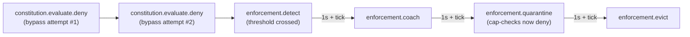

# AP & invoice processing with payment caps

A worked example for an accounts-payable swarm — a classifier
that buckets invoices by amount, an auto-approver that authorizes
small payments, a supervisor that approves the large ones, and a
treasury observer that records every authorized payment. The
substrate point is **role boundaries enforced by the
constitution**: only the supervisor may authorize over-cap
payments, and any agent that tries to bypass that boundary
trips the four-stage enforcement loop.

The runnable demo lives at
[`sdks/python/examples/ap_invoice.py`](https://github.com/abhinavg6/yutha/blob/main/sdks/python/examples/ap_invoice.py).
It runs end-to-end against a real control plane in about
fifteen seconds.

This is the **CrewAI** companion to the
[code-review example](code-review.md), which uses LangGraph. Same
substrate machinery, same audit-trail shape — just different
framework idioms in the agent layer.

For the framework adapter's full surface — `YuthaCrewAgent`
lifecycle, the dispatch loop, the `task_factory` pattern,
`@capability_required` on CrewAI tools, audit-log queries — see
the [CrewAI developer guide](../developer/crewai.md). This page
is the applied walkthrough that exercises that surface
end-to-end with a real Cedar+ constitution and the four-stage
enforcement loop on top.

---

## What this example shows

The [customer-support example](customer-support.md) introduced
identity, capabilities, and operator-driven eviction. The
[code-review example](code-review.md) layered on the constitution
and the four-stage enforcement loop. This one adds two new wrinkles:

- The constitution gates on **the principal's passport-trusted
  attributes** (`principal.framework`), not just on tag content.
  That removes the trust-the-tag question — the approver agent
  can't lie about which role it is, because the framework field
  is signed into the passport at registration and validated
  server-side on every call.
- It's a **CrewAI** demo. Each agent is a CrewAI `Agent` wrapped
  in a `YuthaCrewAgent`; inbound envelopes feed a `task_factory`
  that decides whether to launch a CrewAI Task (LLM-driven) or
  schedule a substrate-side send directly. The demo keeps the
  substrate path LLM-free for determinism — same posture as
  [s1_support_queue_crewai.py](https://github.com/abhinavg6/yutha/blob/main/sdks/python/examples/s1_support_queue_crewai.py).

The demo runs against the same Postgres or in-memory backend you
use for the other examples; no extra backends needed.

---

## The cast

Four CrewAI agents register into a clean swarm. Each carries a
passport with a distinct `framework` label — the constitution
gates directly on this field.

| Agent | `framework` | Role |
|---|---|---|
| `classifier` | `ap-invoice-classifier` | Buckets invoices by amount, routes to approver (within cap) or supervisor (over cap). Sends are not capability-gated. |
| `approver` | `ap-invoice-approver` | Auto-approves small invoices by sending `authorize_payment` to treasury. Outbound sends are capability-gated. The agent whose bypass attempts trip the enforcement loop. |
| `supervisor` | `ap-invoice-supervisor` | Approves large invoices, tagging its sends with `supervisor_approved`. Constitution permits its over-cap authorizations because its framework is not the gated one. |
| `treasury` | `ap-invoice-treasury` | Passive observer; receives every `authorize_payment` envelope so the audit log records the full "who authorized what" trail. |

The threshold for the bucketing is a single Python constant in the
demo (`PAYMENT_CAP_CENTS = 1_000_000`, i.e. $10,000). An auditor
who wants to verify the cap inspects this function plus the
constitution. The agents themselves don't need to be trusted on the
boundary — the constitution decides.

---

## The constitution

```cedar
@id("no-over-cap-without-supervisor-approval")
forbid (
    principal,
    action == Yutha::Action::"SendEnvelope",
    resource
) when {
    context.tags.contains("authorize_payment") &&
    context.tags.contains("amount_over_cap") &&
    !context.tags.contains("supervisor_approved")
};

permit (principal, action, resource);
```

The rule reads as *"no agent may send an `authorize_payment +
amount_over_cap` envelope without also carrying the
`supervisor_approved` tag."* The supervisor's authorize-payment
helper unconditionally adds the tag; the approver's helper
never does. Four traffic patterns cross the rule:

- **Classifier → approver / supervisor**: no `authorize_payment`
  tag, just `invoice` + a bucket tag. Forbid doesn't match;
  permit-all fires.
- **Approver → treasury** (within cap): tagged
  `authorize_payment + amount_within_cap`. Forbid doesn't match
  (no `amount_over_cap`); permit.
- **Supervisor → treasury** (over cap): tagged
  `authorize_payment + amount_over_cap + supervisor_approved`.
  The third forbid condition is satisfied (the tag IS present);
  the negation fails the match; permit.
- **Approver → treasury** (over cap, the bypass): tagged
  `authorize_payment + amount_over_cap` with NO
  `supervisor_approved`. All three forbid conditions hold; the
  policy denies. The SDK raises
  `ConstitutionDenied(deny_reason="forbid_rule_matched")` to the
  caller; the server writes a `constitution.evaluate.deny`
  receipt.

The engine config attaches the four-stage enforcement rule with
1-second cooldowns:

```yaml
enforcement_rules:
  - name: over_cap_bypass_chain
    detect:
      trigger:
        receipt_kind: constitution.evaluate.deny
      count_threshold: 2
      time_window: 60s
      group_by: principal
    coach:
      cooldown: 1s
      guidance_template: "Auto-approver may not authorize over-cap payments"
    quarantine:
      escalate_after: 1s
    evict:
      escalate_after: 1s
      require_countersign: false
    severity: high
```

Two denies inside the 60-second window for the same principal fire
`enforcement.detect`. The chain then progresses on the server's
wall-clock scheduler:



`require_countersign: false` waives the supervisor-tier
countersign that `enforcement.evict` requires by default — the
demo doesn't stand up a supervisor-tier agent dedicated to
countersigning, so the waiver lets the chain land
self-contained.

---

## Why gate on a tag rather than `principal.framework`?

The more honest version of this rule would gate on the
principal's passport-trusted `framework` attribute:

```cedar
forbid when {
    context.tags.contains("authorize_payment") &&
    context.tags.contains("amount_over_cap") &&
    principal.framework == "ap-invoice-approver"
};
```

The approver's framework is part of its
[passport](../concepts/primitives.md) — signed at construction,
validated by the registry at registration, and *should* be
surfaced by the control plane as a trusted attribute on every
constitution evaluation. The approver can mutate its envelope
tags, but it cannot change the framework on its registered
passport without re-registering, which itself leaves an
`agent.register` receipt.

The catch: at the time of writing, the gRPC EnvelopeHandler
**hasn't yet wired the passport resolver into the Cedar entity
snapshot.** The handler synthesizes the principal's Agent entity
with placeholder values — empty framework, minimal tier,
all-zero passport_hash — and the substrate carries a comment
acknowledging that this is a known follow-on from RFC 0011's
attribute-enrichment design. A `principal.framework == "..."`
policy compiles fine but never matches at runtime; the forbid
rule silently degrades to permit-all.

So the demo uses the tag-presence version above. It still
demonstrates the substrate's enforcement loop end-to-end, and the
narrative explanation holds — but a sufficiently adversarial
approver agent could append `supervisor_approved` to its own
sends and bypass. In production today you'd want to reinforce
this with capability caveats: issue the approver a cap whose
scope explicitly does NOT permit the `supervisor_approved` tag,
and gate the supervisor's authorize-payment cap on a
supervisor-tier passport. Both are within reach with the existing
cap-scope machinery; both are tracked in the "what to try next"
section. Wiring the passport resolver — the right long-term
fix — is itself a Phase 3 substrate item.

---

## The classifier dispatch

The classifier doesn't react to inbound envelopes (the demo
orchestrator invokes its dispatch directly with each invoice).
Its outbound send tags the envelope with the amount bucket:

```python
async def dispatch_invoice(invoice: dict[str, Any]) -> yutha.Hash:
    bucket = classify_amount(invoice["amount_cents"])
    dest = approver_id if bucket == TAG_AMOUNT_WITHIN_CAP else supervisor_id
    payload = json.dumps(invoice).encode("utf-8")
    return await classifier_wrapper.send(
        recipient=yutha.Recipient.for_agent(dest),
        performative=yutha.Performative.REQUEST_ACTION,
        payload=payload,
        payload_schema_id="type.yutha.dev/v1/Json",
        tags=[DEMO_TAG, TAG_INVOICE, bucket],
    )
```

`classify_amount()` is the only place the threshold is
interpreted — a single hard-coded constant. Production
implementations would lift this from operator config or a
constitutionally-governed Yutha [memory entity](../concepts/primitives.md)
that itself requires an `enforcement.amend.commit` to change.

---

## The cap-gated approver

The approver's outbound `authorize_payment` send is wrapped
with `@capability_required`. Worth noting: the demo imports the
decorator from `yutha.langgraph.tools` rather than
`yutha.crewai.tools` — the CrewAI-flavoured wrapper is designed
to gate a CrewAI `BaseTool` instance, while we want to gate a
plain coroutine here. Both decorators route through the same
`ACTIVE_CAPABILITY_ID` contextvar, so the substrate behavior is
identical regardless of which one you reach for:

```python
@capability_required(
    approver_wrapper.client,
    approver_cap,
    action_kind="envelope.send",
)
async def authorize_payment(invoice: dict[str, Any], extra_tags: list[str]) -> yutha.Hash:
    payload = json.dumps({"authorized": invoice}).encode("utf-8")
    tags = [DEMO_TAG, TAG_AUTHORIZE_PAYMENT, *extra_tags]
    return await approver_wrapper.send(
        recipient=yutha.Recipient.for_agent(treasury_id),
        performative=yutha.Performative.INFORM,
        payload=payload,
        payload_schema_id="type.yutha.dev/v1/Json",
        tags=tags,
    )
```

The `extra_tags` parameter is what lets the demo orchestrator
drive bypass attempts: passing `[TAG_AMOUNT_OVER_CAP]` produces
the exact combination the constitution forbids. In the
happy-path call (from the approver's `task_factory`), the extra
tags are `[TAG_AMOUNT_WITHIN_CAP]`, the constitution permits, and
treasury observes the authorization.

---

## CrewAI task factories

Each `YuthaCrewAgent` carries a `task_factory` — a function that
fires on every inbound envelope and decides what (if anything)
the CrewAI Agent should do in response. The factory can return a
CrewAI `Task` (LLM call) or `None` (no LLM). For this demo every
factory returns `None`; the LLM is constructed at agent build
time (CrewAI requires this) but never invoked.

The approver's factory looks for invoices and schedules the
authorize-payment send on the dispatch loop:

```python
def factory(
    agent: YuthaCrewAgent,
    env: yutha.Envelope,
    _deliver_id: yutha.Hash,
) -> Any:
    if "authorize" not in approver_holder:
        return None
    loop = agent._dispatch_task.get_loop() if agent._dispatch_task else None
    if loop is None:
        return None
    invoice = json.loads(env.payload.decode("utf-8"))
    authorize = approver_holder["authorize"]

    async def _authorize() -> None:
        try:
            await authorize(invoice, [TAG_AMOUNT_WITHIN_CAP])
        except (CapabilityDenied, yutha.ConstitutionDenied) as e:
            print(f"  [approver] authorize denied: {e}")

    asyncio.run_coroutine_threadsafe(_authorize(), loop)
    return None
```

The `approver_holder` indirection exists because the cap-gated
`authorize` callable depends on a capability that doesn't exist
yet at wrapper-construction time (the cap is issued after all
agents have subscribed). The demo populates the holder once the
cap is issued; from that point on, the factory has a working
authorizer.

The supervisor's factory is identical in structure but calls a
non-cap-gated authorizer that adds the `supervisor_approved` tag.
The classifier's and treasury's factories return `None`
unconditionally — neither reacts to inbound traffic in the demo.

---

## The bypass and the chain

Each bypass attempt is one async call that's expected to raise
`ConstitutionDenied`:

```python
try:
    await authorize(invoice, [TAG_AMOUNT_OVER_CAP])
except yutha.ConstitutionDenied as e:
    assert e.deny_reason == "forbid_rule_matched"
```

After the second attempt, the enforcement engine's
receipt-stream pattern matcher sees two `constitution.evaluate.deny`
receipts with the same `subject_agent_id` inside the 60-second
window and fires `enforcement.detect`. The chain then progresses
through coach, quarantine, and evict at one-second intervals
plus the scheduler tick.

The demo polls the receipt store for the first three stages,
runs the post-quarantine cap-check, then polls for evict. Doing
the cap-check between quarantine and evict mirrors the order in
the S4 conformance scenario — quarantine state lingers post-evict
per [RFC 0013](https://github.com/abhinavg6/yutha/blob/main/spec/rfcs/0013-four-stage-enforcement-loop.md)
§4.2, but landing the check inside the quarantine window is
the conservative choice.

---

## The post-quarantine cap-check

Once `enforcement.quarantine` has fired, the approver's
capability is still cryptographically valid, still in the
capability store, still within its validity window. But:

```python
check_outcome = await wrappers["approver"].client.capability.check(
    approver_cap,
    yutha.ActionDescriptor(action_kind="envelope.send"),
)
assert not check_outcome.permitted
assert check_outcome.deny_reason == "subject_quarantined"
```

The cap layer consults the engine's quarantine state on every
check; the approver is quarantined; the check denies. This is
the most important substrate guarantee the demo demonstrates:
**a quarantined agent can't keep operating on previously-issued
caps**, even though no cap was explicitly revoked.

The check itself produces a `capability.check.deny` receipt
tagged with `deny_reason = "subject_quarantined"` — an
auditor reconstructing the incident sees the engine's quarantine
decision, the cap layer's honoring of it, and the resulting deny
all as separate signed receipts.

---

## The audit-trail delta

The demo computes pre- and post-snapshots and asserts the exact
delta:

```python
EXPECTED_AUDIT_DELTA = {
    "agent.register": 4,           # classifier, approver, supervisor, treasury
    "constitution.activate": 1,    # operator activates the AP constitution
    "envelope.send": 4,            # 4 successful sends
    "envelope.deliver": 4,
    "constitution.evaluate.pass": 4,  # one per successful send
    "constitution.evaluate.deny": 2,  # two bypass attempts
    "capability.issue": 1,         # approver's send cap
    "capability.check.pass": 3,    # approver's happy + 2 bypass sends pass cap-check
    "capability.check.deny": 1,    # post-quarantine explicit check
    "enforcement.detect": 1,
    "enforcement.coach": 1,
    "enforcement.quarantine": 1,
    "enforcement.evict": 1,
}
```

The same shape as the code-review demo, with `agent.register`
ticking up by one (four agents instead of three). The two
bypass attempts produce `constitution.evaluate.deny` rather than
`capability.check.deny` because cap-check runs first server-side
and the cap is valid at that point — only the constitution
denies. The post-quarantine `capability.check()` call is the one
source of `capability.check.deny`.

---

## Running it

```bash
# Mint a seed (once per run).
export YUTHA_BOOTSTRAP_SEED=$(python -c \
    'import secrets; print(secrets.token_hex(32))')

# CrewAI's Agent constructor requires an LLM credential. Set
# whichever provider's key you have on hand. The demo never
# actually invokes the LLM (the substrate path is deterministic
# and bypasses the LLM-driven Task path), but the construction
# step needs the credential to exist.
export OPENAI_API_KEY=...

# Start the control plane with the seed-derived operator pubkey.
cargo run -p yutha-control-plane -- \
    --admission-mode open \
    --operator-public-key $(python sdks/python/examples/ap_invoice.py --print-operator-pubkey)

# Run the demo in a second shell with the same seed exported.
python sdks/python/examples/ap_invoice.py
```

A clean run prints each phase and ends with the audit delta
block:

```text
# Phase 12 — audit-trail delta
  ✓ agent.register                +4  (expected +4)
  ✓ constitution.activate         +1  (expected +1)
  ✓ envelope.send                 +4  (expected +4)
  ✓ envelope.deliver              +4  (expected +4)
  ✓ constitution.evaluate.pass    +4  (expected +4)
  ✓ constitution.evaluate.deny    +2  (expected +2)
  ✓ capability.issue              +1  (expected +1)
  ✓ capability.check.pass         +3  (expected +3)
  ✓ capability.check.deny         +1  (expected +1)
  ✓ enforcement.detect            +1  (expected +1)
  ✓ enforcement.coach             +1  (expected +1)
  ✓ enforcement.quarantine        +1  (expected +1)
  ✓ enforcement.evict             +1  (expected +1)

✓ audit-trail shape matches expectations
```

Total wall-clock is dominated by the enforcement chain's
cooldowns — roughly ten seconds. The script exits with status 1
if any delta doesn't match.

---

## What to try next

A few directions to extend the example:

- **Reinforce role boundaries with cap caveats.** The current
  constitution trusts the supervisor's helper to add
  `supervisor_approved` and trusts the approver not to. Issue the
  approver a capability whose scope's `caveats` explicitly forbid
  the `supervisor_approved` tag, and require the supervisor's
  passport to be supervisor-tier before its cap is minted. Both
  layers compose: even if a bug in the approver's code adds the
  tag, the cap layer would deny before the constitution gets a
  chance to evaluate.
- **Wire the passport resolver in the control plane.** The
  substrate-correct version of this constitution would gate on
  `principal.framework == "ap-invoice-approver"`. That requires
  the gRPC EnvelopeHandler to enrich the Cedar Agent entity with
  real attributes from the PassportStore (RFC 0011's
  attribute-enrichment design). Once that pass lands, every demo
  that wants to discriminate by role gets a server-trusted
  channel for it.
- **Duplicate-invoice detection.** Add an enforcement rule whose
  `detect.trigger.receipt_kind` is `envelope.send` and whose
  pattern groups by `vendor + amount` within a 24-hour window.
  Two matching authorizations fire a soft warning; three move
  the chain to quarantine. The receipt-stream pattern matcher
  handles this without any agent-side memory.
- **Reverse path.** Use `enforcement.reverse` to roll back a
  detect or quarantine stage after a human reviewer confirms the
  duplicate was actually intentional. The reverse receipt
  references the original detect receipt, the audit log records
  the human's reason, and the agent's reputation recovers.
- **Tier-aware approval ladders.** Set
  `require_countersign: true` on evict, register a passport with
  `tier=Supervisor`, and require the supervisor to countersign
  every eviction. The evict receipt only lands once the
  countersign arrives — useful when the bypass-handling itself
  needs human sign-off.
- **Cross-organization federation.** Have the supervisor live in
  a different swarm than the approver, with a federation
  agreement linking the two. The supervisor's `supervisor_approved`
  tag arrives across the federation boundary; the constitution
  enforces uniformly regardless of which swarm the message
  originated in. (Federation primitives are sketched in design
  notes — see [cross-organization federation](cross-org-federation.md).)

---

## See also

- [Code review crew with security boundaries](code-review.md) —
  the LangGraph constitution example; same machinery, simpler
  business framing.
- [Customer support with a refund cap](customer-support.md) —
  the simpler example; identity + capability + operator-driven
  eviction without a constitution.
- [CrewAI developer guide](../developer/crewai.md) — full
  treatment of the `YuthaCrewAgent` wrapper and `task_factory`
  pattern this demo builds on.
- [RFC 0013 — four-stage enforcement loop](https://github.com/abhinavg6/yutha/blob/main/spec/rfcs/0013-four-stage-enforcement-loop.md)
  — the design decisions behind detect / coach / quarantine /
  evict and the reversal semantics.
