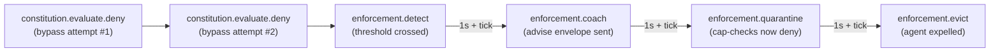

# Code review crew with security boundaries

A worked example for a swarm of code-review agents — a reviewer
that classifies pull requests, an auto-fix agent that applies the
safe ones, and a human approver that handles the security-sensitive
rest. The substrate point is **norm enforcement under load**: when
the auto-fix agent tries to bypass the security boundary, the
constitution catches it, and the four-stage enforcement loop
(detect → coach → quarantine → evict) trips on the way down.

The runnable demo lives at
[`sdks/python/examples/code_review.py`](https://github.com/abhinavg6/yutha/blob/main/sdks/python/examples/code_review.py).
It runs end-to-end against a real control plane in about
fifteen seconds.

For the framework adapter's full surface — `YuthaAgent`
lifecycle, the LangGraph dispatch loop,
`@capability_required` patterns, audit-log queries — see the
[LangGraph developer guide](../developer/langgraph.md). This
page is the applied walkthrough that exercises that surface
end-to-end with a real Cedar+ constitution and the four-stage
enforcement loop on top.

---

## What this example shows

This is the first runnable Python demo that exercises the
constitution + enforcement layers end-to-end over gRPC. The
[customer-support example](customer-support.md) covered
identity, capabilities, and operator-driven eviction; this one
goes further:

- An operator activates a custom Cedar+ constitution that gates
  every `SendEnvelope` action against a forbid rule on tags.
- A reviewer LangGraph workflow classifies PRs by file path and
  routes them to either auto-fix (safe paths) or a human
  approver (security-sensitive paths).
- Auto-fix's outbound sends are wrapped with
  `@capability_required` — server-side capability checks fire
  before each envelope hits the wire.
- Two bypass attempts (`patch_applied + security_sensitive`)
  produce `constitution.evaluate.deny` receipts and cross the
  enforcement rule's threshold.
- The enforcement loop progresses through all four stages with
  ~1s cooldowns; the demo polls the receipt store for each one
  to land.
- A post-quarantine capability check returns deny with
  reason `subject_quarantined` — the cap layer is consulting
  the engine's quarantine state, not just the cap's own validity.
- The audit-trail delta is computed against a pre-flow snapshot
  and asserted exactly — every consequential action leaves a
  receipt.

The demo runs against the same Postgres or in-memory backend you
use for the customer-support example; no extra backends needed.

---

## The cast

Three agents register into a clean swarm. Each carries a passport
with a free-form `framework` label so audit queries can filter by
role:

| Agent | Framework label | Role |
|---|---|---|
| `reviewer` | `code-review-reviewer` | Classifies PRs, routes to either auto-fix or the human approver. Sends are not capability-gated. |
| `auto_fix` | `code-review-auto-fix` | Applies patches on safe paths. Outbound sends are capability-gated via `@capability_required`. The agent whose bypass attempts trip the enforcement loop. |
| `human_approver` | `code-review-human-approver` | Receives security-sensitive PRs. Passive observer in the demo. |

A real implementation would have the human approver actually
respond; for the demo it just logs receipt.

---

## The constitution

Yutha's [Cedar+](../concepts/constitution.md) constitution layer
gates every `SendEnvelope` call against a Cedar policy plus an
engine-side configuration. The demo's Cedar source is one
`forbid` rule plus a permit-all fallback:

```cedar
@id("no-security-patches-from-auto-fix")
forbid (
    principal,
    action == Yutha::Action::"SendEnvelope",
    resource
) when {
    context.tags.contains("security_sensitive") &&
    context.tags.contains("patch_applied")
};

permit (principal, action, resource);
```

The rule reads as *"no agent may send an envelope tagged both
`security_sensitive` and `patch_applied`"* — i.e. no agent may
claim to have auto-applied a patch to a security-sensitive file.
Three traffic patterns cross this rule:

- **Reviewer routes a sensitive PR to the human approver** —
  the envelope carries `security_sensitive` but not
  `patch_applied`. The forbid rule does not match; the
  permit-all fallback fires.
- **Auto-fix sends `patch_applied` for a non-sensitive file** —
  the envelope carries `patch_applied` but not
  `security_sensitive`. Same outcome: permit.
- **Auto-fix sends `patch_applied + security_sensitive`** —
  the bypass we're guarding against. Forbid rule matches;
  Cedar denies; the substrate raises `ConstitutionDenied`
  to the caller and writes a `constitution.evaluate.deny`
  receipt.

The engine config adds the enforcement rule that turns repeated
denies into stage progression:

```yaml
enforcement_rules:
  - name: security_tag_bypass_chain
    detect:
      trigger:
        receipt_kind: constitution.evaluate.deny
      count_threshold: 2
      time_window: 60s
      group_by: principal
    coach:
      cooldown: 1s
      guidance_template: "Auto-fix may not patch security-sensitive files"
    quarantine:
      escalate_after: 1s
    evict:
      escalate_after: 1s
      require_countersign: false
    severity: high
```

Two denies within a 60-second window, grouped by principal, fire
`enforcement.detect`. After detect, the four stages chain with
1-second cooldowns:



`require_countersign: false` on the evict stage waives the
supervisor-tier countersign that the
[canonical-actions spec](https://github.com/abhinavg6/yutha/blob/main/spec/receipt/canonical-actions.md)
requires by default — the demo doesn't stand up a supervisor
agent, and the waiver keeps the chain self-contained.

The full constitution artifact is built inline in the demo
script with a small helper:

```python
def build_code_review_constitution(swarm_id: yutha.SwarmId) -> Constitution:
    return Constitution(
        spec_version="1.0.0",
        schema_version="1.1.0",
        constitution_version="1.0.0",
        parent_version=None,
        swarm_id=swarm_id,
        cedar_source=_CODE_REVIEW_CEDAR_SOURCE,
        engine_config_yaml=_CODE_REVIEW_ENGINE_CONFIG_YAML,
        issued_at=yutha.Timestamp.now(),
    )
```

Activation requires an operator-bearer client:

```python
async with yutha.YuthaClient.connect_as_operator(
    server_addr,
    operator_id="yutha-demo:code-review:operator",
    swarm_id=swarm_id,
    operator_signer=op_signer,
) as op_client:
    activated = await op_client.constitution.activate(constitution)
```

The activation itself emits a `constitution.activate` substrate
receipt; every subsequent `constitution.evaluate.*` receipt
anchors back to it via `constitution_hash`.

---

## The classifier graph

The reviewer's LangGraph workflow is two nodes — classify then
dispatch:

```python
def classify_pr(state: ReviewerState) -> ReviewerState:
    """Tag a PR as sensitive if its file path lives under any of
    the configured security-sensitive prefixes."""
    path = state["file_path"]
    is_sensitive = any(path.startswith(p) for p in SECURITY_SENSITIVE_PREFIXES)
    return {"is_sensitive": is_sensitive}


async def dispatch(state: ReviewerState) -> ReviewerState:
    is_sensitive = state["is_sensitive"]
    dest = human_approver_id if is_sensitive else auto_fix_id
    tags = [DEMO_TAG, "review_request"]
    if is_sensitive:
        tags.append(SECURITY_SENSITIVE_TAG)
    payload = f"FILE: {state['file_path']}\n\n{state['pr_text']}".encode()
    receipt = await reviewer_agent.send(
        recipient=yutha.Recipient.for_agent(dest),
        performative=yutha.Performative.REQUEST_ACTION,
        payload=payload,
        payload_schema_id="type.yutha.dev/v1/Text",
        tags=tags,
    )
    return {"destination_agent_id": dest, "send_receipt_id": receipt}
```

The reviewer's sends do *not* present a capability — open-mode
topology only requires capabilities on agents that explicitly
mint them, and the reviewer's role is routing-only. The
constitution still gates these sends; both classification
branches produce `constitution.evaluate.pass` receipts because
the forbid rule doesn't match either tag combination.

The security-sensitive prefix list is hard-coded for the demo:

```python
SECURITY_SENSITIVE_PREFIXES = (
    "crates/yutha-crypto/",
    "crates/yutha-capability/",
    "spec/",
    "contracts/",
)
```

A production implementation would lift this from `CODEOWNERS`,
a policy file, or a Yutha [memory entity](../concepts/primitives.md)
that's itself constitutionally governed.

---

## The cap-gated auto-fix

Auto-fix's outbound send is wrapped with `@capability_required`,
the same decorator used in the customer-support example:

```python
@capability_required(
    auto_fix_agent.client,
    auto_fix_cap,
    action_kind="envelope.send",
)
async def send_patch_applied(payload: bytes, extra_tags: list[str]) -> yutha.Hash:
    tags = [DEMO_TAG, PATCH_APPLIED_TAG, *extra_tags]
    return await auto_fix_agent.send(
        recipient=yutha.Recipient.for_agent(reviewer_id),
        performative=yutha.Performative.INFORM,
        payload=payload,
        payload_schema_id="type.yutha.dev/v1/Text",
        tags=tags,
    )
```

The decorator threads `capability_id` through to the Send RPC.
The server then runs cap-check *before* constitution-check; both
must pass for the envelope to land. On the bypass attempts the
cap is still valid (its scope is `envelope.send` with no tag
restrictions), so cap-check passes and constitution-check is
what denies.

You could push the tag restrictions into the capability itself
via [caveats](../concepts/primitives.md), in which case the
cap-check would deny instead. The trade-off is where you want
the policy authored — Cedar (visible, versioned, auditable as
a constitution amendment) versus the cap (per-token, fine-
grained, but harder to reason about in aggregate). For
"no security-tagged auto-fixes," Cedar is the natural fit
because the rule is about the *kind* of action, not about which
specific capability authorized it.

---

## The bypass and the chain

Each bypass attempt is a single async call that raises
`ConstitutionDenied`:

```python
try:
    await send_patch_applied(
        f"PATCH_APPLIED: {file_path}".encode(),
        extra_tags=[SECURITY_SENSITIVE_TAG],
    )
except yutha.ConstitutionDenied as e:
    assert e.deny_reason == "forbid_rule_matched"
```

After the second attempt, the enforcement engine's receipt-stream
pattern matcher sees two denies inside the 60-second window for
the same principal and fires `enforcement.detect`. The four-stage
chain progresses on the server-side scheduler; the demo polls the
receipt store for each stage to land:

```python
for stage in (
    "enforcement.detect",
    "enforcement.coach",
    "enforcement.quarantine",
):
    await wait_for_kind_delta(
        auto_fix.client, stage, before[stage], expected_delta=1
    )
```

The demo polls for the first three stages, then runs the
post-quarantine cap-check, then polls for evict. Doing the
cap-check between quarantine and evict matches the spec's
intra-quarantine semantics directly — quarantine state lingers
post-evict per [RFC 0013](https://github.com/abhinavg6/yutha/blob/main/spec/rfcs/0013-four-stage-enforcement-loop.md)
§4.2, but landing the check inside the quarantine window is
the conservative choice.

---

## The post-quarantine cap-check

This is the substrate's quietest but most important guarantee:
**the cap layer consults the enforcement engine's quarantine
state on every check.** Auto-fix's capability was never revoked.
It's still cryptographically valid, still in the capability
store, still well within its validity window. But:

```python
check_outcome = await auto_fix.client.capability.check(
    auto_fix_cap,
    yutha.ActionDescriptor(action_kind="envelope.send"),
)
assert not check_outcome.permitted
assert check_outcome.deny_reason == "subject_quarantined"
```

The check produces a `capability.check.deny` receipt with
`deny_reason = "subject_quarantined"`. The quarantine state was
applied by the enforcement engine, but it's the cap layer that
honors it on every subsequent check — without that wiring, a
quarantined agent could keep operating on previously-issued
caps until each one was individually revoked.

---

## The audit-trail delta

The demo asserts the exact shape of the audit trail it produced.
Pre-snapshot before any work, post-snapshot after the chain
completes, delta is the receipts attributable to this run:

```python
EXPECTED_AUDIT_DELTA = {
    "agent.register": 3,           # reviewer + auto_fix + human_approver
    "constitution.activate": 1,    # operator activates the constitution
    "envelope.send": 3,            # 3 successful sends
    "envelope.deliver": 3,         # mirrored deliveries
    "constitution.evaluate.pass": 3,  # one per successful send
    "constitution.evaluate.deny": 2,  # two bypass attempts
    "capability.issue": 1,         # auto_fix's send cap
    "capability.check.pass": 3,    # auto_fix's happy + 2 bypass sends pass cap-check
    "capability.check.deny": 1,    # post-quarantine explicit check
    "enforcement.detect": 1,
    "enforcement.coach": 1,
    "enforcement.quarantine": 1,
    "enforcement.evict": 1,
}
```

Some non-obvious things in this table:

- The two bypass attempts contribute to `capability.check.pass`,
  not `capability.check.deny`. Cap-check runs first server-side;
  the cap is valid (no quarantine yet); cap-check passes; only
  then does constitution-check fail. The single `capability.check.deny`
  is the explicit post-quarantine check in Phase 10.
- There is no `envelope.send` or `envelope.deliver` receipt for
  the denied attempts. The Send RPC short-circuits on
  constitution-deny; no envelope ever lands.
- The four enforcement-stage receipts have wall-clock-dependent
  timing. The demo's pre/post snapshot pattern absorbs this —
  the delta is computed after polling has confirmed each stage
  landed.

---

## Running it

Same env-var contract as the customer-support example, plus the
operator pubkey:

```bash
# Mint a seed (once per run).
export YUTHA_BOOTSTRAP_SEED=$(python -c \
    'import secrets; print(secrets.token_hex(32))')

# Start the control plane in open admission mode with the
# matching operator pubkey. The demo's helper subcommand derives
# the pubkey from the seed for you.
cargo run -p yutha-control-plane -- \
    --admission-mode open \
    --operator-public-key $(python sdks/python/examples/code_review.py --print-operator-pubkey)

# Run the demo in a second shell with the same seed exported.
python sdks/python/examples/code_review.py
```

A clean run prints each phase's progress and finishes with the
audit delta block:

```text
# Phase 12 — audit-trail delta
  ✓ agent.register                +3  (expected +3)
  ✓ constitution.activate         +1  (expected +1)
  ✓ envelope.send                 +3  (expected +3)
  ✓ envelope.deliver              +3  (expected +3)
  ✓ constitution.evaluate.pass    +3  (expected +3)
  ✓ constitution.evaluate.deny    +2  (expected +2)
  ✓ capability.issue              +1  (expected +1)
  ✓ capability.check.pass         +3  (expected +3)
  ✓ capability.check.deny         +1  (expected +1)
  ✓ enforcement.detect            +1  (expected +1)
  ✓ enforcement.coach             +1  (expected +1)
  ✓ enforcement.quarantine        +1  (expected +1)
  ✓ enforcement.evict             +1  (expected +1)

✓ audit-trail shape matches expectations
```

Total wall-clock is dominated by the enforcement chain's
cooldowns — roughly ten seconds. The script exits with status 1
if any delta doesn't match.

---

## What to try next

A few directions to extend the example, in roughly increasing
ambition:

- **Tighten the constitution.** Replace the simple tag-based
  forbid rule with one that also gates `IssueCapability` — make
  it impossible for an agent to mint itself a cap that lets it
  bypass the security boundary by changing tag conventions.
- **Add a fourth agent: a supervisor.** Set
  `require_countersign: true` on the evict stage, register a
  passport with `tier=Supervisor`, and have the supervisor
  countersign the evict effect. The eviction receipt only lands
  after the countersign arrives.
- **Anchor the audit trail.** Enable
  [Sui anchoring](../operator/sui-anchoring.md) and re-run the
  demo. Every enforcement receipt becomes verifiable to a third
  party who has only the constitution and the on-chain
  commitment — no trust in your control plane required.
- **Swap the classifier for an LLM.** The keyword-prefix
  classifier in the demo is substrate-focused; in production
  you'd want a real review pass over the diff. The substrate
  doesn't care which classifier you use — the constitution
  fires on the *outcome* of the classification, not its
  internals.

---

## See also

- [Customer support with a refund cap](customer-support.md) —
  the simpler example; identity + capability + operator-driven
  eviction, no constitution.
- [LangGraph developer guide](../developer/langgraph.md) — full
  treatment of the framework adapter and the SDK surface this
  demo builds on.
- [Cedar+ schema (canonical v1.1)](https://github.com/abhinavg6/yutha/blob/main/spec/constitution/schema.cedarschema)
  — the entity / action / context types Cedar policies can name.
- [RFC 0013 — four-stage enforcement loop](https://github.com/abhinavg6/yutha/blob/main/spec/rfcs/0013-four-stage-enforcement-loop.md)
  — the design that decides what each stage means and how
  reversal works.
