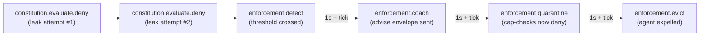

# Procurement platform with vendor isolation

A worked example for a **heterogeneous-framework swarm** — a
buyer's intake agent built on LangGraph collaborating with three
vendor agents each built on CrewAI, all coordinating through one
Yutha control plane. The substrate point is what *only* Yutha
can do here: bounded, attenuated capabilities enforce a real
multi-party confidentiality wall, the audit trail is a neutral
record both sides can verify in a dispute, and the four-stage
enforcement loop handles a bad-acting vendor without any
framework-specific code.

The runnable demo lives at
[`sdks/python/examples/procurement_platform.py`](https://github.com/abhinavg6/yutha/blob/main/sdks/python/examples/procurement_platform.py).
It runs end-to-end against a real control plane in about
fifteen seconds.

For the framework adapter surfaces this example builds on, see
the [LangGraph developer guide](../developer/langgraph.md) (for
the buyer-side intake) and the
[CrewAI developer guide](../developer/crewai.md) (for the vendor
agents). This page is the applied walkthrough that shows the two
adapters cooperating through the same substrate, in the shape
you'd actually deploy.

---

## The platform framing

A mid-to-large enterprise runs an internal procurement platform.
Its procurement team posts RFPs over time — for software,
services, equipment, whatever. **Approved vendors** (vendors the
buyer has invited and onboarded; this is not an open marketplace)
submit proposals against whichever RFP they're responding to.

On the buyer's side, an intake agent receives each submission,
routes it to the correct RFP's evaluation, scores against that
RFP's criteria, and flags high-value items for a human approver.

On each vendor's side, that vendor's own agent assembles and
submits the proposal.

It's a *standing platform*, not a one-shot — queue-mode intake,
RFPs and submissions flowing continuously. It's not a federation
either: every agent registers into the buyer's single swarm. (The
federation upgrade is honest future work; see "Where this goes
next" below.)

### Why the framework split is honest here

Many vendors build their submission agents independently, over
time — heterogeneity is **guaranteed, not contrived**. The
buyer's intake agent is built by the buyer's team on its own
framework. Nobody coordinated. The example's first cut is
LangGraph on the buyer side, CrewAI for vendors; the pairing is
swappable as more adapters land, and the substrate doesn't care
which agent is in which framework.

---

## What this example shows

The point of the example is the **vendor isolation wall**, and
each layer of the substrate enforces one slice of it.

The earlier examples each demonstrated one substrate layer in
isolation; this one stacks them:

- **Distinct passports per framework.** All five agents register
  with their own signed identity. The buyer side carries
  `framework: langgraph`; the vendors carry `framework: crewai`.
  The audit log treats them identically — there is no
  privileged framework.
- **Bounded capabilities (centerpiece).** A vendor agent may
  submit to the RFP it's invited to and respond to clarifications
  on it; it *cannot* see other vendors' submissions, other RFPs'
  data, or the buyer's internal scoring. This is the capability
  model enforcing a real multi-party confidentiality wall — the
  thing that's structurally absent from any single-framework
  guardrail approach.
- **Queue-mode intake.** Every vendor submission lands at the
  same `buyer_intake` inbox; the intake's LangGraph workflow
  uses the envelope's `rfp:<id>` tag to route to the right
  per-RFP scoring path. Demonstrates the queue topology, applied
  to a multi-tenant flow.
- **Constitution as procurement rules.** A Cedar+ constitution
  forbids the leakage tag combination; the same engine config
  could (and in a real deployment would) also forbid post-
  deadline submissions. A bypass attempt trips the four-stage
  enforcement loop — `enforcement.detect` → `coach` →
  `quarantine` → `evict`.
- **Receipt log as neutral record.** Submission timing,
  clarification requests, scoring routing — every consequential
  action is signed and content-addressed. Verifiable by both
  sides without trusting each other or the operator.

---

## The cast

Five agents register into a clean swarm. Three framework labels
among them — the constitution gates on tags, not on framework, so
the labels are descriptive only:

| Agent | Framework | Role |
|---|---|---|
| `buyer_intake` | `langgraph` | Single intake + scorer. Receives every vendor submission, classifies by `rfp:<id>` tag, scores against RFP criteria, escalates high-value items. Sends to the human approver are not capability-gated; the constitution still gates them. |
| `human_approver` | `langgraph` | Passive observer for escalated submissions. A real implementation would reply with an approval or rejection envelope. |
| `vendor_alpha` | `crewai` | Invited to RFP-101 only. Carries one capability with an `OnlyIfTagged` caveat requiring `rfp:RFP-101`. **The bad actor in this demo.** |
| `vendor_beta` | `crewai` | Invited to both RFP-101 and RFP-202. Carries two capabilities, one per RFP. Submits well-behaved proposals to both. |
| `vendor_gamma` | `crewai` | Invited to RFP-202 only. Symmetric to vendor_alpha on the other RFP. |

The buyer side runs on the LangGraph adapter; the three vendors
run on the CrewAI adapter. Both adapters route through the same
`ACTIVE_CAPABILITY_ID` contextvar and the same gRPC client; the
substrate sees one swarm and one audit log.

---

## The bounded capabilities

This is the centerpiece. Each vendor gets one capability per RFP
they were invited to. The capability is scoped to
`envelope.send` and carries an `OnlyIfTagged` caveat that
requires the envelope's tags to include the specific RFP tag:

```python
def build_vendor_capability(
    vendor_id: yutha.AgentId,
    rfp_id: str,
    swarm_id: yutha.SwarmId,
) -> yutha.Capability:
    return yutha.Capability(
        spec_version="1.0.0",
        capability_id=secrets.token_bytes(16),
        swarm_id=swarm_id,
        issuer=yutha.Issuer.for_agent(vendor_id),
        subject=vendor_id,
        scope=yutha.Scope.for_action("envelope.send"),
        valid_from=yutha.Timestamp.now(),
        valid_until=FAR_FUTURE,
        caveats=[
            yutha.Caveat(
                only_if_tagged=yutha.OnlyIfTaggedCaveat(
                    required_tags=[f"rfp:{rfp_id}"],
                )
            )
        ],
    )
```

The cap layout mirrors the invitations exactly — four caps total
across three vendors:

```text
vendor_alpha → 1 cap : OnlyIfTagged(["rfp:RFP-101"])
vendor_beta  → 2 caps: OnlyIfTagged(["rfp:RFP-101"])
                       OnlyIfTagged(["rfp:RFP-202"])
vendor_gamma → 1 cap : OnlyIfTagged(["rfp:RFP-202"])
```

The Send-path cap-check on the server bridges `envelope.tags`
into the `ActionDescriptor`'s `resource_tags`. So when a vendor
sends an envelope, the cap-check evaluates the caveat against
the envelope's actual tags:

- vendor_alpha sends tagged `[..., rfp:RFP-101, submission]`
  using cap_alpha → caveat satisfied → cap passes.
- vendor_alpha sends tagged `[..., rfp:RFP-202, submission]`
  using cap_alpha → caveat unmet (the cap requires
  `rfp:RFP-101`, the envelope is tagged for RFP-202) → cap
  denies before the envelope hits the wire.

This is what *structurally* prevents a vendor from submitting to
RFPs it wasn't invited to. The vendor's prompt or code could try
to — the substrate would refuse to forward the envelope. No
runtime check inside the vendor agent, no LLM judgment call, no
trust that the vendor's framework will behave. The cap is signed,
content-addressed, and the check is one of the substrate's
core operations.

A second cap (for vendor_beta's second invitation) is not a
widening of the first; it's a separate authority token with its
own identity, validity window, and revocation path. An operator
revoking vendor_beta's RFP-202 cap atomically — for example
because a different vendor won the bid and the platform is
closing the round — doesn't affect its RFP-101 work.

---

## The constitution

The vendor isolation wall has two layers. The cap layer handles
the structural piece — "vendors can only send envelopes tagged for
RFPs they were invited to." The constitution handles policy — the
demo's stand-in for **"a vendor agent may never exfiltrate
insight about another vendor's bid."**

The Cedar source has two forbid rules plus the required permit-
all fallback:

```cedar
@id("no-cross-vendor-data-leakage")
forbid (
    principal,
    action == Yutha::Action::"SendEnvelope",
    resource
) when {
    context.tags.contains("submission") &&
    context.tags.contains("leak_other_vendor_data")
};

@id("no-post-deadline-submissions")
forbid (
    principal,
    action == Yutha::Action::"SendEnvelope",
    resource
) when {
    context.tags.contains("submission") &&
    context.tags.contains("past_deadline")
};

permit (principal, action, resource);
```

The first rule is the load-bearing one for the demo's enforcement
chain. The second is a belt-and-braces sanity check that mirrors
a real procurement platform's deadline requirement; with the
demo's far-future fixture deadlines, the rule sits idle, but the
policy is wired so an operator running the demo against a real
RFP timeline would see it activate.

Three traffic patterns cross the leakage rule:

- **vendor_alpha submits tagged `rfp:RFP-101 + submission`** —
  no `leak_other_vendor_data` tag; rule 1 doesn't match; the
  permit-all fallback fires.
- **buyer_intake escalates tagged `escalation + human_review`**
  — neither rule's tag combination is present; permit fires.
- **vendor_alpha submits tagged
  `rfp:RFP-101 + submission + leak_other_vendor_data`** — the
  bypass we're guarding against. Cap-check passes (the rfp tag
  satisfies the caveat); constitution-check fails; the
  substrate raises `ConstitutionDenied` and a
  `constitution.evaluate.deny` receipt lands.

The engine config attaches a single enforcement rule that turns
repeated denies into stage progression:

```yaml
enforcement_rules:
  - name: vendor_leakage_bypass_chain
    detect:
      trigger:
        receipt_kind: constitution.evaluate.deny
      count_threshold: 2
      time_window: 60s
      group_by: principal
    coach:
      cooldown: 1s
      guidance_template: "Vendor agents may not exfiltrate cross-vendor data"
    quarantine:
      escalate_after: 1s
    evict:
      escalate_after: 1s
      require_countersign: false
    severity: high
```

Two denies inside a 60-second window for the same principal fire
`enforcement.detect`. The chain then progresses on the server's
wall-clock scheduler — coach 1s after detect, quarantine 1s after
coach, evict 1s after quarantine. `require_countersign: false`
waives the supervisor-tier countersign for the evict stage
because the demo doesn't stand up a supervisor agent.



---

## The buyer-side LangGraph workflow

Buyer intake's three-node graph runs on every inbound submission:
classify the RFP from the envelope tag, score the bid against an
in-memory threshold, escalate to the human approver if it's high-
value.

```python
def classify_rfp(state: IntakeState) -> IntakeState:
    rfp_id = _extract_rfp_id(state["envelope_tags"])
    if rfp_id is None:
        raise ValueError(
            f"submission envelope has no rfp:<id> tag; tags={state['envelope_tags']!r}"
        )
    return {"rfp_id": rfp_id}


def score_submission(state: IntakeState) -> IntakeState:
    submission = json.loads(state["envelope_payload"].decode("utf-8"))
    is_high_value = (
        submission.get("bid_amount_cents", 0) > HIGH_VALUE_THRESHOLD_CENTS
    )
    return {"submission": submission, "is_high_value": is_high_value}
```

The escalation node fires only if `is_high_value` is true, and
sends a structured envelope to the human approver. Note what the
escalation payload deliberately does **not** carry — other vendors'
submission ids, other RFPs' details, or the buyer's full scoring
rubric. The confidentiality wall extends to the human-review side
of the buyer's organization too:

```python
async def maybe_escalate(state: IntakeState) -> IntakeState:
    if not state["is_high_value"]:
        return {}
    submission = state["submission"]
    rfp_id = state["rfp_id"]
    payload = json.dumps({
        "rfp_id": rfp_id,
        "submission_id": submission["submission_id"],
        "vendor": submission["vendor"],
        "bid_amount_cents": submission["bid_amount_cents"],
        "reason_for_escalation": (
            f"bid_amount > ${HIGH_VALUE_THRESHOLD_CENTS / 100:,.0f} threshold"
        ),
    }).encode("utf-8")
    receipt = await intake_agent.send(
        recipient=yutha.Recipient.for_agent(human_approver_id),
        performative=yutha.Performative.REQUEST_ACTION,
        payload=payload,
        payload_schema_id="type.yutha.dev/v1/Json",
        tags=[DEMO_TAG, TAG_ESCALATION, rfp_tag(rfp_id), TAG_HUMAN_REVIEW],
    )
    return {"escalation_receipt_id": receipt}
```

The intake agent's escalation send is not cap-gated — open-mode
topology only requires capabilities on agents that explicitly
mint them, and the intake's role is routing-only. The
constitution still gates the send; the permit-all fallback fires
because the escalation envelope's tags don't match either forbid
rule.

---

## The vendor-side CrewAI tools

Each vendor's submit helper is a plain async function wrapped
with the LangGraph flavour of `@capability_required`. Both
flavours of the decorator route through the same
`ACTIVE_CAPABILITY_ID` contextvar; the CrewAI-specific flavour is
for wrapping a `BaseTool` instance, and we're wrapping a plain
async function here, so the LangGraph flavour is the right
ergonomic choice even though the vendor agent itself is CrewAI.

The cap-required submit helper unconditionally adds the cap's
required RFP tag — that's what makes the same helper work for
both well-behaved and bypass attempts:

```python
@capability_required(
    vendor_wrapper.client,
    vendor_cap,
    action_kind="envelope.send",
)
async def submit(submission: dict[str, Any], extra_tags: list[str]) -> yutha.Hash:
    payload = json.dumps(submission).encode("utf-8")
    tags = [DEMO_TAG, TAG_SUBMISSION, *required_tags, *extra_tags]
    return await vendor_wrapper.send(
        recipient=yutha.Recipient.for_agent(buyer_intake_id),
        performative=yutha.Performative.REQUEST_ACTION,
        payload=payload,
        payload_schema_id="type.yutha.dev/v1/Json",
        tags=tags,
    )
```

The cross-RFP attempt helper is structurally different — it
deliberately tags the envelope with the WRONG RFP for the cap
being presented, so the cap's `OnlyIfTagged` caveat is unmet:

```python
@capability_required(
    vendor_wrapper.client,
    vendor_cap,
    action_kind="envelope.send",
)
async def attempt(submission: dict[str, Any]) -> yutha.Hash:
    payload = json.dumps(submission).encode("utf-8")
    # target_rfp_id is the WRONG RFP for the cap; cap-check denies.
    tags = [DEMO_TAG, TAG_SUBMISSION, rfp_tag(target_rfp_id)]
    return await vendor_wrapper.send(
        recipient=yutha.Recipient.for_agent(buyer_intake_id),
        performative=yutha.Performative.REQUEST_ACTION,
        payload=payload,
        payload_schema_id="type.yutha.dev/v1/Json",
        tags=tags,
    )
```

A CrewAI tool body would more typically look like a
`BaseTool._run` that calls these helpers — see the
[s1 CrewAI port](https://github.com/abhinavg6/yutha/blob/main/sdks/python/examples/s1_support_queue_crewai.py)
for that shape. For this demo we drive the helpers directly to
keep the audit-trail shape deterministic; the substrate path is
identical.

---

## The flow

The runnable demo's thirteen phases compose to the audit-trail
delta:

```text
Phase 0   pre-flow snapshot
Phase 1   register 5 agents (2 langgraph + 3 crewai)
Phase 2   start dispatch loops
Phase 3   operator activates procurement constitution
Phase 4   issue 4 vendor caps (one per invited RFP)
Phase 5   cross-RFP attempt (vendor_alpha → RFP-202)
              → cap denies with unmet caveat
Phase 6   4 happy submissions (vendors → buyer_intake)
              → buyer_intake's LangGraph runs on each
              → vendor_beta's high-value RFP-202 bid escalates
Phase 7   wait for escalation to land at human_approver
Phase 8   vendor_alpha leakage attempt #1 → constitution denies
Phase 9   vendor_alpha leakage attempt #2 → enforcement.detect
Phase 10  poll for detect → coach → quarantine
Phase 11  post-quarantine cap-check on vendor_alpha
              → subject_quarantined
Phase 12  wait for enforcement.evict
Phase 13  snapshot delta + report
```

Phase 5 is the load-bearing cap-layer demonstration; phase 6 is
the queue-mode + LangGraph workflow exercise; phases 8–9 set up
the constitution-layer enforcement chain; phase 11 verifies the
cap layer is consulting the engine's quarantine state, not just
the cap's own validity.

---

## The post-quarantine cap-check

This is the substrate's quietest but most important guarantee:
**the cap layer consults the enforcement engine's quarantine
state on every check.** vendor_alpha's RFP-101 capability was
never revoked. It's still cryptographically valid, still in the
capability store, still well within its validity window. But:

```python
check_outcome = await vendor_wrappers["vendor_alpha"].client.capability.check(
    vendor_caps[("vendor_alpha", "RFP-101")],
    yutha.ActionDescriptor(action_kind="envelope.send"),
)
assert not check_outcome.permitted
assert check_outcome.deny_reason == "subject_quarantined"
```

Without that wiring, a quarantined agent could keep operating on
previously-issued caps until each one was individually revoked.
With it, the quarantine state is honored across the agent's
entire cap chain in one stroke. The receipt that lands is a
`capability.check.deny` with `deny_reason = "subject_quarantined"`
— content-addressed evidence that the cap layer saw the
quarantine and refused the action.

---

## The audit-trail delta

The demo asserts the exact shape of the audit trail it produced.
Pre-snapshot before any work; post-snapshot after the chain
completes; delta is the receipts attributable to this run:

```python
EXPECTED_AUDIT_DELTA = {
    "agent.register": 5,            # 2 buyer + 3 vendors
    "constitution.activate": 1,
    "envelope.send": 5,             # 4 vendor + 1 intake escalation
    "envelope.deliver": 5,
    "constitution.evaluate.pass": 5,
    "constitution.evaluate.deny": 2,  # 2 leakage bypasses
    "capability.issue": 4,          # 1 alpha + 2 beta + 1 gamma
    "capability.check.pass": 6,     # 4 happy + 2 bypass (cap still passes)
    "capability.check.deny": 2,     # cross-RFP + post-quarantine
    "enforcement.detect": 1,
    "enforcement.coach": 1,
    "enforcement.quarantine": 1,
    "enforcement.evict": 1,
}
```

Some non-obvious things in this table:

- **The cross-RFP attempt produces a `capability.check.deny`
  but no `envelope.send`.** Cap-check runs first server-side and
  short-circuits the Send RPC on deny. No envelope lands; no
  delivery receipt either.
- **The two leakage attempts produce
  `capability.check.pass` *and* `constitution.evaluate.deny`.**
  Cap-check sees the cap's caveat satisfied (the rfp tag is
  present); cap passes; constitution-check then sees the
  forbidden tag combination and denies. Both layers run; both
  produce receipts; the order is cap-check first, constitution-
  check second.
- **No envelope receipts for the bypass attempts either.** The
  Send RPC short-circuits on constitution-deny too. The
  `envelope.send` / `envelope.deliver` counts only count
  envelopes that survived both gates.
- **vendor_beta's high-value RFP-202 bid generates one
  `envelope.send` from vendor_beta and a *second*
  `envelope.send` from buyer_intake (the escalation to the
  human approver).** Both are counted; the intake's escalation
  is the only buyer-initiated send in the demo.

---

## Running it

Same env-var contract as the other constitution demos, plus the
operator pubkey:

```bash
# Mint a seed (once per run).
export YUTHA_BOOTSTRAP_SEED=$(python -c \
    'import secrets; print(secrets.token_hex(32))')

# CrewAI Agents require an LLM credential at construction time
# even when the substrate path bypasses the LLM.
export OPENAI_API_KEY=...

# Start the control plane in open admission mode with the
# matching operator pubkey. The demo's helper subcommand derives
# the pubkey from the seed.
cargo run -p yutha-control-plane -- \
    --admission-mode open \
    --operator-public-key $(python sdks/python/examples/procurement_platform.py --print-operator-pubkey)

# Run the demo in a second shell with the same seed exported.
python sdks/python/examples/procurement_platform.py
```

A clean run prints each phase's progress and finishes with the
audit delta block:

```text
# Phase 13 — audit-trail delta
  ✓ agent.register                +5  (expected +5)
  ✓ constitution.activate         +1  (expected +1)
  ✓ envelope.send                 +5  (expected +5)
  ✓ envelope.deliver              +5  (expected +5)
  ✓ constitution.evaluate.pass    +5  (expected +5)
  ✓ constitution.evaluate.deny    +2  (expected +2)
  ✓ capability.issue              +4  (expected +4)
  ✓ capability.check.pass         +6  (expected +6)
  ✓ capability.check.deny         +2  (expected +2)
  ✓ enforcement.detect            +1  (expected +1)
  ✓ enforcement.coach             +1  (expected +1)
  ✓ enforcement.quarantine        +1  (expected +1)
  ✓ enforcement.evict             +1  (expected +1)

✓ audit-trail shape matches expectations
```

Total wall-clock is dominated by the enforcement chain's
cooldowns — roughly ten seconds. The script exits with status 1
if any delta doesn't match.

---

## Where this goes next

The platform framing **upgrades cleanly** after Phase 4 of the
build plan: each vendor runs its own swarm in its own
infrastructure, federating with the buyer's platform —
re-demonstrating federated identity and cross-swarm receipts
without changing the story. The example is built so that future
upgrade is natural; nothing here assumes single-swarm
permanence.

Specifically, the seams that will move on federation day:

- **Vendor passports** become cross-swarm: today every vendor
  registers into the buyer's swarm; post-federation each vendor's
  agent lives in its own swarm and presents a cross-swarm
  passport at the buyer's control plane.
- **Capabilities** become operator-issued across the trust
  boundary: today the vendor agent self-issues for demo
  simplicity; in the federated version the buyer's operator
  issues the per-(vendor, RFP) cap, the vendor accepts it, and
  the cap's content-address binds the issuance to a specific
  RFP timeline.
- **The receipt log** becomes mirrored: today the buyer's
  control plane owns the receipts; post-federation the
  federation-relevant subset is synchronized to each vendor's
  control plane so both sides have the same authoritative log
  for their slice of the interaction.

The substrate is designed for this; the federation-specific glue
is what's missing. See the
[cross-org federation sketch](cross-org-federation.md) for the
shape that work will take.

A few directions to extend the example *before* federation lands,
in roughly increasing ambition:

- **Add a procurement supervisor.** Set `require_countersign:
  true` on the evict stage, register a passport with
  `tier=Supervisor`, and have the supervisor countersign every
  vendor eviction. The eviction receipt only lands after the
  countersign arrives.
- **Sui-anchor the audit trail.** Enable
  [Sui anchoring](../operator/sui-anchoring.md) and re-run the
  demo. Every consequential receipt — submission, cap-check
  outcome, constitution evaluation, enforcement progression —
  becomes verifiable to a third party (a regulator, an auditor,
  a winning vendor's counsel) without trusting the buyer's
  infrastructure.
- **Wire a real classifier into buyer_intake.** Replace the
  deterministic threshold with an LLM-driven scoring pass over
  the RFP rubric. The substrate doesn't care which classifier
  picks which destination; only the resulting tags drive the
  audit trail.
- **Tighten the constitution.** Add a rule that gates
  `IssueCapability` so a vendor can't mint itself a cap for an
  RFP it wasn't invited to. (Today the demo's self-issuance
  pattern would still work; the rule would close that gap.)

---

## See also

- [Customer support with a refund cap](customer-support.md) —
  the simpler example; identity + capability + operator-driven
  eviction, no constitution.
- [Code review crew with security boundaries](code-review.md) —
  the constitution + enforcement-chain example, single
  framework (LangGraph).
- [AP & invoice processing with payment caps](ap-invoice.md) —
  the constitution + enforcement-chain example, single
  framework (CrewAI). Where this example departs: there, role
  boundaries within one buyer; here, **multi-party boundaries
  across organizations**, enforced by capability caveats.
- [LangGraph developer guide](../developer/langgraph.md) — full
  treatment of the buyer-side adapter surface this demo builds
  on.
- [CrewAI developer guide](../developer/crewai.md) — full
  treatment of the vendor-side adapter surface this demo builds
  on.
- [Cedar+ schema (canonical v1.1)](https://github.com/abhinavg6/yutha/blob/main/spec/constitution/schema.cedarschema)
  — the entity / action / context types Cedar policies can name.
- [RFC 0013 — four-stage enforcement loop](https://github.com/abhinavg6/yutha/blob/main/spec/rfcs/0013-four-stage-enforcement-loop.md)
  — the design that decides what each stage means and how
  reversal works.
