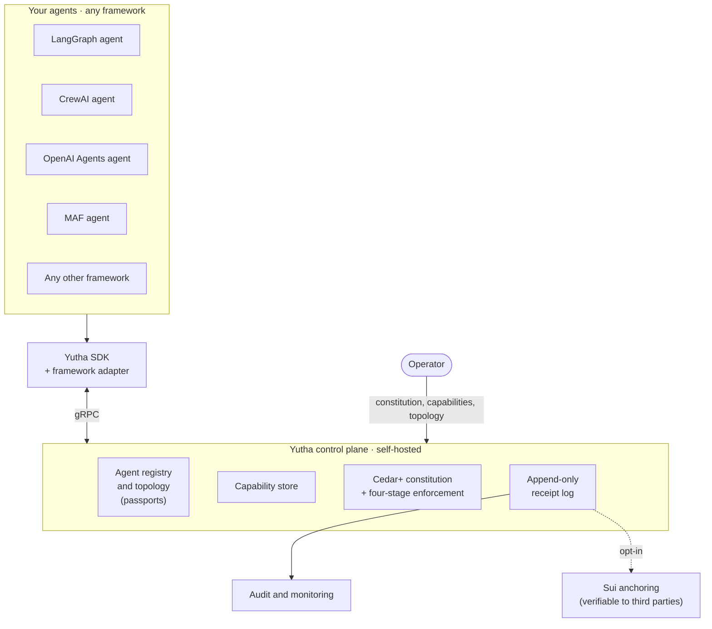

# Agents are easy to build. Swarms are not.

!!! info "Status — early-stage pre-release"

    Yutha is at **[v0.1.0-alpha.1](https://github.com/abhinavg6/yutha/releases/tag/v0.1.0-alpha.1)** — solid enough to play with end-to-end, intentionally pre-1.0. The shape of the project is settled; wire formats and API surfaces may shift before 1.0. Pin tightly if you build on it, and [open an issue](https://github.com/abhinavg6/yutha/issues) if you hit something.

**Yutha** — from the Sanskrit [यूथ (*yūtha*)](https://www.wisdomlib.org/definition/yutha) meaning a herd, troop, or band moving together — is open-source infrastructure for groups of AI agents. Two friends running hobby agents in a Discord, a marketing team coordinating a half-dozen agents inside one company, a regulated workflow with hundreds of agents across departments, or thousands of agents collaborating across organizations: same primitives, same audit log, same enforcement, same Yutha.

You can stand up a *single* agent in an afternoon. Coordinating a handful — or a hundred — of them, in a way you'd trust for a customer interaction, an internal workflow, or a cross-company integration, is a different problem entirely. Almost every team rebuilds the same scaffolding from scratch: who an agent is, what it's allowed to do, what it actually did, and which norms govern the swarm it lives in. Each agent framework solves a fragment and stops.

**Yutha is that scaffolding, built once, framework-agnostic.** It runs in front of agents you've already built — in [LangGraph](https://github.com/langchain-ai/langgraph), [CrewAI](https://www.crewai.com/), [OpenAI Agents](https://github.com/openai/openai-agents-python), [Microsoft Agent Framework](https://github.com/microsoft/agent-framework), or anything else you'd like to write an adapter for — and gives them passports, signed receipts, attenuated capabilities, declarative constitutions with four-stage enforcement, and an optional cryptographic verification layer for when a third party needs to audit what happened.

*How it fits together: your agents talk to the self-hosted control plane through the Yutha SDK. The control plane gates every consequential action against capabilities and the active constitution, and writes a signed receipt for each one. Audit and monitoring follow from the receipt log; Sui anchoring is an opt-in layer for when a third party needs to verify the trail without trusting the operator.*

-   :material-clock-fast:{ .lg .middle } **Run an agent through it in 15 minutes**

    ---

    Bring an existing LangGraph, CrewAI, OpenAI Agents, or Microsoft Agent Framework agent. Wrap it with the Python SDK. Join an existing swarm. Get a passport, a capability, and a signed audit trail.

    [:octicons-arrow-right-24: Developer quickstart](developer/quickstart.md)

-   :material-server:{ .lg .middle } **Stand up your own swarm in 30 minutes**

    ---

    A control plane, a constitution, and a topology of your choosing — closed, open, or hybrid — on infrastructure you own.

    [:octicons-arrow-right-24: Operator quickstart](operator/quickstart.md)

## The problem Yutha solves

A multi-agent system makes a lot of small decisions every minute. Each one is *consequential* in the way that database writes are consequential — it touches a customer, spends a budget, ends a session, escalates to a human. When something goes wrong:

- **You can't tell which agent did it.** Identity is implicit or per-framework.
- **You can't prove what was authorized.** Capability checks live in code, not as artifacts.
- **You can't reconstruct what happened.** Logs are best-effort, mutable, often missing the why.
- **You can't enforce norms uniformly.** Each framework's "guardrails" are written differently and trust each other transitively.
- **You can't prove any of the above to a third party.** Internal logs don't survive an audit.

These are not framework problems. They're substrate problems. They show up no matter which framework you build the agents in, and trying to solve them inside the framework leaks them across systems the moment you compose two different frameworks together. Yutha is the layer underneath the frameworks, so the substrate looks the same regardless of how the agents above were built.

## What Yutha gives you

**Identity that's portable.** Every agent carries an Ed25519-backed *passport*: a verifiable identity that doesn't depend on which framework or runtime built the agent. Passports are issued by an operator, revocable, and traceable.

**Typed messaging with audit.** Agents talk through *envelopes* — structured messages with a sender, a recipient (or role, or swarm-wide broadcast), a typed action, and a payload. Every consequential send produces an append-only *receipt*: signed, content-addressed, deterministic. Receipts are the source of truth.

**Capabilities, not permissions.** Authority is granted as bounded, attenuable *capabilities* — first-class tokens that say *who* may do *what* for *how long* on *which targets*. Capabilities can be narrowed (never widened) when delegated, revoked atomically, and cascaded across delegation chains. Cap checks happen at the control plane, not in each agent's code.

**Constitutions, declaratively.** Norms governing a swarm are written in Cedar+, an extension of AWS's [Cedar](https://github.com/cedar-policy) policy language with soft scoring rules and procedural state machines. The control plane evaluates every consequential action against the active constitution. Violations progress through a four-stage enforcement loop — detect, coach, quarantine, evict — never as a single all-or-nothing decision.

**Optional cryptographic verification.** When the operator needs to prove the audit trail to a third party — a regulator, a customer, a downstream system — Yutha can anchor Merkle roots of receipt batches to a public blockchain ([Sui](https://www.sui.io/) today). Anyone can independently verify the seal without trusting the operator.

**Pluggable backends.** Receipt storage in Postgres for production or in-memory for development, optional anchoring on Sui — same APIs, swap the implementation behind the spec.

## Who it's for

-   :material-shield-account:{ .lg .middle } **Operators**

    ---

    Stand up the control plane, set the topology (closed / open / hybrid), author and activate constitutions, manage operator credentials, monitor receipts, anchor for verifiability. You own the swarm.

    [:octicons-arrow-right-24: Operator guide](operator/index.md)

-   :material-code-braces:{ .lg .middle } **Developers**

    ---

    Build agents in the framework you already like — LangGraph, CrewAI, OpenAI Agents, Microsoft Agent Framework, or anything else with a Python toolchain — and bring them to a Yutha-governed swarm. Adapters handle the passport, the cap-checking, the receipt emission.

    [:octicons-arrow-right-24: Developer guide](developer/index.md)

## What people build with it

Each card below maps to a walkthrough under [Examples](examples/index.md). Five are runnable end-to-end demos you can stand up against a local control plane in an afternoon; cross-organization federation is a design sketch — the substrate primitives are there, the federation-specific glue lands in a later phase.

-   :material-headset:{ .lg .middle } **Customer support swarms**

    ---

    Router + specialists + supervisor escalation. Per-agent identity, capability-gated dispatch, live cap-revoke, and operator-driven eviction — the substrate primitives the other examples layer policy on top of. The audit log shows exactly which agent did what.

    [:octicons-arrow-right-24: Walkthrough](examples/customer-support.md)

-   :material-source-branch:{ .lg .middle } **Code review crews**

    ---

    Reviewer + auto-fix agents on every PR. Constitution forbids `patch_applied + security_sensitive` envelopes; two bypass attempts walk the four-stage enforcement loop end-to-end (detect → coach → quarantine → evict). Every change leaves a signed receipt.

    [:octicons-arrow-right-24: Walkthrough](examples/code-review.md)

-   :material-file-document-check:{ .lg .middle } **AP & invoice processing**

    ---

    Classifier, auto-approver, supervisor, treasury. Constitution caps single payments and gates over-cap authorizations on a `supervisor_approved` tag; the approver's bypass attempts trip the same enforcement chain. SOX-grade audit trail by default.

    [:octicons-arrow-right-24: Walkthrough](examples/ap-invoice.md)

-   :material-book-search-outline:{ .lg .middle } **Research crew with citation enforcement**

    ---

    Researcher, fact-checker, editor connected by OpenAI Agents' handoff primitive. Constitution forbids `claim_published` envelopes that lack `verified_citations`; every handoff produces a Yutha audit envelope so the full collaboration chain is reconstructable from the receipt log.

    [:octicons-arrow-right-24: Walkthrough](examples/research-crew.md)

-   :material-alarm-light-outline:{ .lg .middle } **DevOps incident-response with SRE countersign**

    ---

    Incident commander, diagnoser, schema specialist, SRE, remediation executor — a Microsoft Agent Framework swarm walking a runbook. Constitution forbids production `schema_change` actions unless an `sre_countersigned` tag is present; bypass attempts trip the four-stage enforcement chain.

    [:octicons-arrow-right-24: Walkthrough](examples/devops-incident.md)

-   :material-handshake:{ .lg .middle } **Cross-organization federation**

    ---

    Your reviewer agents talking to my publisher agents under a constitution both sides have ratified. Capabilities issued across org boundaries; receipts visible to both. Two companies' agents collaborating without trusting each other's infrastructure.

    [:octicons-arrow-right-24: Walkthrough (sketch)](examples/cross-org-federation.md)

## What Yutha is *not*

Yutha is intentionally not a lot of things. Drawing the boundary explicitly is part of how it stays focused.

**Not a platform for building or hosting agents.** You build the agents in your framework of choice. Yutha never owns the agent's reasoning loop, prompt, or model. It governs how agents interact, not what they think.

**Not a model service.** No model hosting, no inference layer, no opinion on which LLM you use. Bring your own.

**Not a chat product or assistant.** Yutha is infrastructure. Humans interact with the swarm through whatever UI the operator builds on top.

**Not a managed service.** There's no Yutha cloud to sign up for and no service to pay a subscription to. The reference implementation runs on infrastructure you already operate — Postgres, object storage, the cloud (or laptop) of your choice. The optional verifiability backend is opt-in and self-hosted.

**Not framework-opinionated.** LangGraph, CrewAI, OpenAI Agents, and Microsoft Agent Framework adapters ship today. Anyone can write an adapter for a new framework against the spec; no permission required. Adapters in other languages (TypeScript, Go) are welcomed when the demand shows up.

**Not a reputation engine.** Yutha tracks a reputation scalar per agent, but it is never the sole basis for a permission decision. Reputation informs; capabilities and the constitution decide.

## Where the project is

Yutha is open-source, Apache 2.0, stewarded by a single maintainer right now. The reference implementation runs end-to-end across the Rust control plane and Python SDK; four framework adapters (LangGraph, CrewAI, OpenAI Agents, Microsoft Agent Framework) are functional with a runnable end-to-end example each; the conformance suite covers the receipt log, send-path enforcement, operator revocation, constitution evaluation, the four-stage enforcement loop, and the verifiability anchor.

A handful of directions have been thought through but aren't built yet — pre-production swarm simulation, cross-swarm federation primitives, adapters in non-Python languages. They live as design notes in the RFC archive. Whether and when they ship depends on what the community ends up needing. The [GitHub repo](https://github.com/abhinavg6/yutha) is the place to follow along or propose something.

## Read next

- [Concepts → Primitives](concepts/primitives.md) — passports, envelopes, receipts, capabilities, in fifteen minutes.
- [Operator → Quickstart](operator/quickstart.md) — stand up a swarm of your own.
- [Developer → Quickstart](developer/quickstart.md) — join one with an existing agent.
- [Examples → Customer support with refund cap](examples/customer-support.md) — a worked end-to-end use case.
